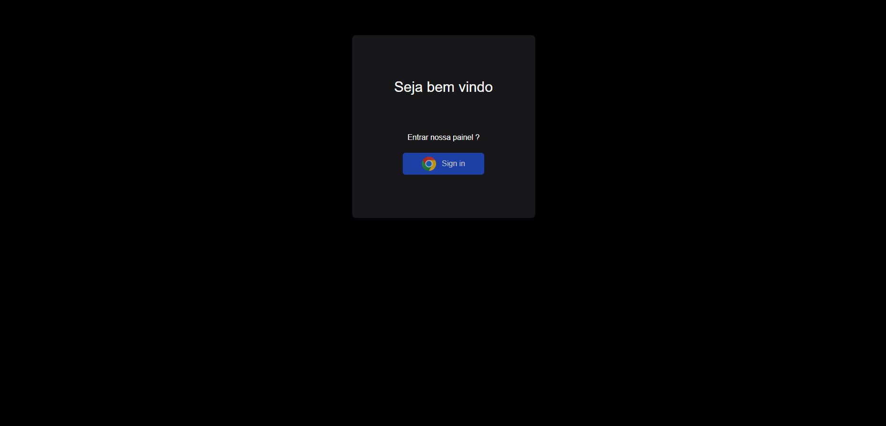
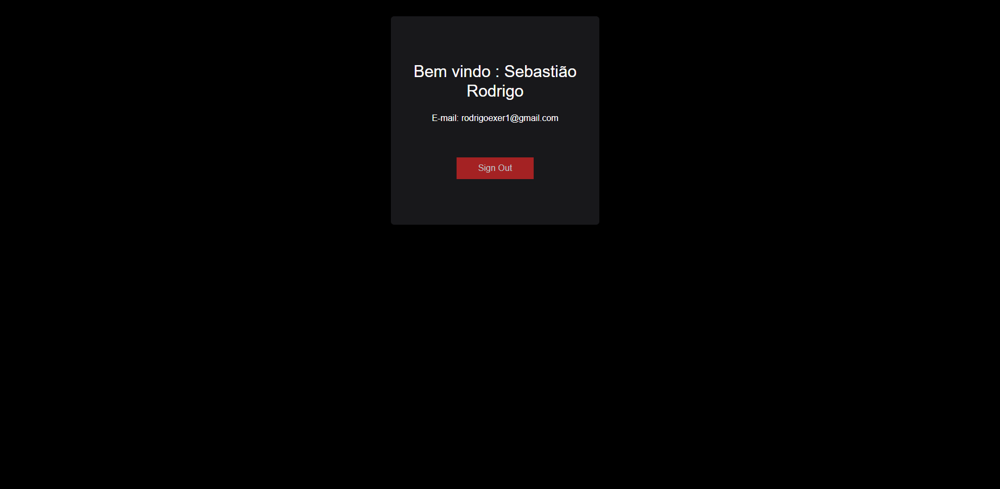

Desafio next auth

* SHOW
npm install next-auth@beta

* SHOW

#### .env.local

```
npx auth secret
```

```
AUTH_GOOGLE_ID=
```

```
AUTH_GOOGLE_SECRET=
```

#### Resumo

#### Páginas




##### arquivos


##### Dependências
  * npm run build


##### Modelo de EsLint
````
import { FlatCompat } from '@eslint/eslintrc'

const compat = new FlatCompat({
  // import.meta.dirname is available after Node.js v20.11.0
  baseDirectory: import.meta.dirname,
})

const eslintConfig = [
  ...compat.config({
    extends: ['next'],
    rules: {
      'react/no-unescaped-entities': 'off',
      '@next/next/no-page-custom-font': 'off',
    },
  }),
]

export default eslintConfig
````

#### URI
http://localhost:3000/api/auth/callback/google
https://next-google-4qzp-phi.vercel.app/api/auth/callback/google


#### Ref.
```
https://www.youtube.com/watch?v=XQbiMiNah0o
```

```
https://www.youtube.com/watch?v=8PrDwsoOxf4
```